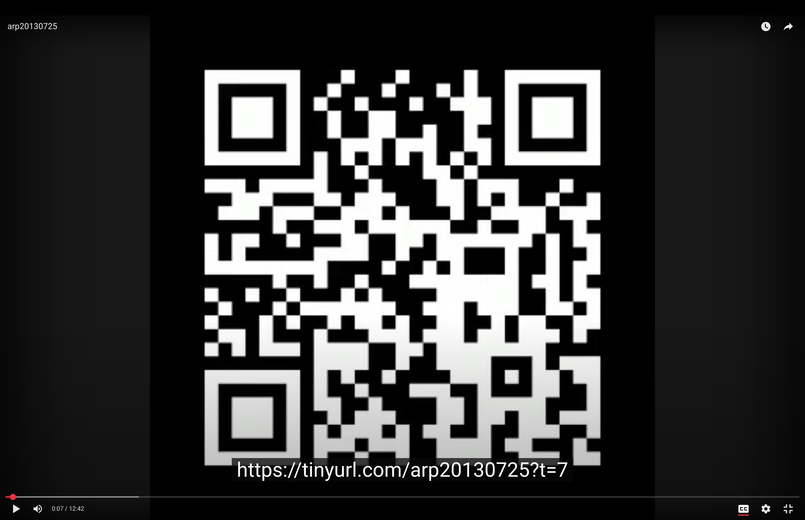

# Running QR Codes for YouTube Audio

[](https://www.youtube.com/watch?v=deqMGh-Hu2w)

Generate a video of **continuously updating QR codes** that point to the *current timestamp* of your audio on YouTube.  
Viewers can pause at any moment, scan the on-screen QR, and jump straight to that exact time. ([example](https://www.youtube.com/watch?v=deqMGh-Hu2w))

For a different take see [A Video That Points to Itself: Self-Referencing Audio on YouTube with QR Codes](https://bwagner.github.io/self_ref_yt_vid/)

> **Use case:** Long podcasts, lectures, musical jam sessions, or interviews uploaded to YouTube.  
> This script makes it easy to bookmark and share precise moments with a phone camera—no scrubbing required.

---

## ✨ Features

- Creates a video with QR codes that update every *N* seconds.
- QR codes point to `SHORTENER_URL?t=SECONDS`.
- Exports to any video format ffmpeg supports.
- Optionally generates an `.srt` subtitle file with URLs per timestamp.
- Designed for use with URL shorteners like TinyURL.

---

## 📦 Requirements

- **Python 3.9+**
- **ffmpeg + ffprobe** installed and in `PATH`
- Python dependencies:
  - `opencv-python`
  - `numpy`
  - `qrcode[pil]`
  - `rich`
  - `typer`

> If you use [uv](https://github.com/astral-sh/uv), the shebang at the top of the script handles dependencies automatically.

---

## 🔗 Workflow with TinyURL

1. Pick a unique short URL stem (don’t create it yet), e.g.  
   `https://tinyurl.com/arp20130725`
2. Run the script with your audio file and the chosen stem.
3. Upload the generated video (and optional `.srt`) to YouTube.
4. Create the TinyURL and point it to your YouTube video URL.
5. Scanning QR codes in the video now jumps to the correct timestamp.

---

## 🚀 Usage

### Using `uv` (recommended)

```bash
chmod +x self_ref_yt_vid.py
./self_ref_yt_vid.py audio.mp3 https://tinyurl.com/arp20130725 -o qr_codes_video.mp4 -d 1
```

### Using Python directly

```bash
python -m venv .venv
source .venv/bin/activate    # Windows: .venv\Scripts\activate
pip install opencv-python numpy "qrcode[pil]" rich typer

python self_ref_yt_vid.py audio.mp3 https://tinyurl.com/arp20130725 \
  --output qr_codes_video.mp4 --duration 1
```

---

## 🧰 CLI Reference

```
 Usage: self_ref_yt_vid.py [OPTIONS] AUDIO_FILE_PATH SHORTENER_STEM

╭─ Arguments ──────────────────────────────────────────────────────────────────╮
│ *    audio_file_path      TEXT  Path to the audio file whose duration will   │
│                                 determine the length of the video.           │
│                                 [required]                                   │
│ *    shortener_stem       TEXT  Base URL stem for the shortener. QR codes    │
│                                 will be generated based on this stem.        │
│                                 [required]                                   │
╰──────────────────────────────────────────────────────────────────────────────╯
╭─ Options ────────────────────────────────────────────────────────────────────╮
│ --output          -o      TEXT     Output path for the generated QR code     │
│                                    video.                                    │
│                                    [default: (stem of audio file .mp4)]      │
│ --duration        -d      INTEGER  Duration in seconds for which each QR     │
│                                    code is displayed in the video.           │
│                                    [default: 1]                              │
│ --generate-video                   Generate video file. [default: True]      │
│ --subtitles-only                   Generate only subtitles.                  │
│ --help                             Show this message and exit.               │
╰──────────────────────────────────────────────────────────────────────────────╯
```

---

## 🗂️ Outputs

- `qr_codes_video.mp4` – video with QR codes + audio  
- `qr_codes_video.srt` – matching subtitles with QR URLs

Example `.srt`:

```
1
00:00:00 --> 00:00:01
https://tinyurl.com/arp20130725?t=0

2
00:00:01 --> 00:00:02
https://tinyurl.com/arp20130725?t=1
```

---

## ⚙️ Tips

- Use **incognito mode** when testing, to prevent YouTube’s resume position from overriding `t=…`.
- For better scan reliability:
  - Increase QR display duration (`-d 2` or `-d 5`).
  - Scale video to higher resolution after rendering:
    ```bash
    ffmpeg -i qr_codes_video.mp4 -vf "scale=1920:1080:flags=neighbor" -c:a copy qr_1080p.mp4
    ```

---

## 📁 Project Structure

```
.
├── self_ref_yt_vid.py   # Main script
└── README.md
```

---

## 🧾 License

MIT License

```
MIT License

Permission is hereby granted, free of charge, to any person obtaining a copy
of this software and associated documentation files (the "Software"), to deal
in the Software without restriction, including without limitation the rights
to use, copy, modify, merge, publish, distribute, sublicense, and/or sell
copies of the Software, and to permit persons to whom the Software is
furnished to do so, subject to the following conditions:

The above copyright notice and this permission notice shall be included in
all copies or substantial portions of the Software.

THE SOFTWARE IS PROVIDED "AS IS", WITHOUT WARRANTY OF ANY KIND, EXPRESS OR
IMPLIED, INCLUDING BUT NOT LIMITED TO THE WARRANTIES OF MERCHANTABILITY,
FITNESS FOR A PARTICULAR PURPOSE AND NONINFRINGEMENT. IN NO EVENT SHALL THE
AUTHORS OR COPYRIGHT HOLDERS BE LIABLE FOR ANY CLAIM, DAMAGES OR OTHER
LIABILITY, WHETHER IN AN ACTION OF CONTRACT, TORT OR OTHERWISE, ARISING FROM,
OUT OF OR IN CONNECTION WITH THE SOFTWARE OR THE USE OR OTHER DEALINGS IN
THE SOFTWARE.
```

---

## 🙌 Acknowledgements

- [ffmpeg](https://ffmpeg.org/)
- [qrcode](https://pypi.org/project/qrcode/)
- [opencv-python](https://pypi.org/project/opencv-python/)
- [rich](https://pypi.org/project/rich/)
- [typer](https://typer.tiangolo.com/)
