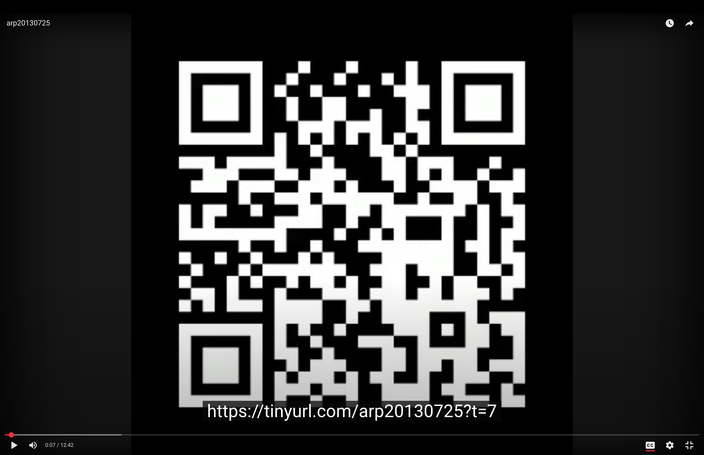

# Turning Audio into Running QR Codes for YouTube

[](https://www.youtube.com/watch?v=deqMGh-Hu2w)


Youtube is for uploading videos. What if you want to upload audio? You need at
least a still image to go along with your audio. I had this question and
wondered what image I should upload with my audio, since the primary purpose
was to get the audio up there. I thought of simply making a still image of a
qr-code encoding a URL pointing to somewhere related to the audio. But what?
The youtube video itself! But the youtube video URL is only revealed to you
*after* uploading your video to youtube! Here's where David Wheeler's wisdom
comes in:

> Any problem [in computer science] can be solved with another layer of indirection.

We delegate the problem of generating a QR code pointing to an unknown URL by
pointing to a known URL instead, which in turn will redirect to the final youtube
URL, __once it's known__. Ok. But youtube allows to jump to any section in a video
with a second's resolution. So, let's simply generate a video of QR codes that
change every second and point to the respective audio section in the video.
Voilà: That's what this script does.

---

## ✨ How it works

1. You start by preparing a TinyURL that will eventually redirect to your YouTube link.
   You need to use a TinyURL that's (very likely) to be unused! Note down your
   tinyurl, which will look similar to this: `https://tinyurl.com/arp20130725`.
2. Run this script passing the path to your audio as first command line parameter and
   the tinyurl as the 2nd parameter. Courtesy of ffmpeg, a vast array of audio formats
   are supported as input.)
3. The script generates a video where the **QR code updates every second** (or at a custom interval).
4. You upload the generated video to YouTube (and optionally the generated .srt subtitle file)
5. Note the **real** URL of your video and have your prepared tinyurl redirect to the
   real youtube URL.
6. Now scanning any QR in the video takes you to that exact timestamp.

---

## 🧩 Example use cases

- Podcasts → share a joke or story precisely.
- Lectures → jump straight to an important explanation.
- Audiobooks → reference specific passages without scrolling.
- Long-form interviews → bookmark your favorite answers.
- Musical Jam Sessions → Share your favorite moments, or mark down candidate sections for songs/compositions.

---

## 📦 Tech under the hood

- **Python** (scripted with help from AI)
- **qrcode** → generates the QR codes
- **OpenCV** → handles QR rendering and video frames
- **ffmpeg/ffprobe** → mux audio + video and read durations
- **typer** + **rich** → nice CLI and progress bars

---

## 🚀 Quickstart

With [uv](https://github.com/astral-sh/uv):

```bash
chmod +x run_qr_codes.py
./run_qr_codes.py audio.mp3 https://tinyurl.com/arp20130725 -o qr_codes_video.mp4 -d 1
```

Result:  
- `qr_codes_video.mp4` → upload this to YouTube  
- `qr_codes_video.srt` → optional subtitles with the QR-encoded URLs

---

## ⚡ Lessons learned

- YouTube often ignores `t=…` if you’ve watched before → use **Incognito mode** to test.  
- QR readability matters → scaling up to 1080p helps.  
- Slower QR cadence (every 2–5 seconds) is easier to scan than every 1 second.  
- Most of the code scaffolding was generated with AI, and then tuned by hand.

---

## 🔗 Links

- GitHub repo: [https://github.com/bwagner/self_ref_yt_vid](https://github.com/bwagner/self_ref_yt_vid)

---

